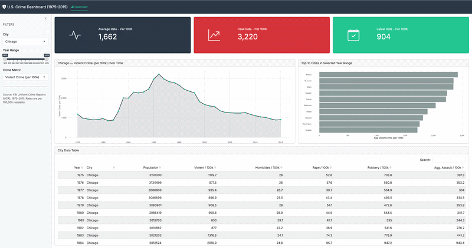

# 🔍 U.S. Crime Dashboard (1975–2015)

An interactive Shiny application designed to visualize and analyze historical Uniform Crime Reporting (UCR) data. This tool allows users to filter by year and region to uncover trends in public safety across four decades.

> 🚀 **Live App:** [View on Posit Connect Cloud](https://019ceec3-c9e6-7117-7cda-8fa587b7f50b.share.connect.posit.cloud/)

------------------------------------------------------------------------

## Features

| Feature | Detail |
|----|----|
| **Input – City selector** | Dropdown to pick any of the 68 cities in the dataset |
| **Input – Year range slider** | Filter the analysis window from 1975 to 2015 |
| **Input – Crime metric** | Choose between violent crime, homicides, rape, robbery, or aggravated assault (all per 100k residents) |
| **Reactive data frame** | All plots and value boxes update instantly when any filter changes |
| **Value boxes (×3)** | Average rate, peak rate, and latest-year rate for the selected city & metric |
| **Trend line plot** | Yearly trend for the selected city with an area fill |
| **Bar chart** | Top 10 cities by average rate; selected city highlighted in red |
| **Data table** | Paginated, searchable raw data for the selected city |

------------------------------------------------------------------------

## Dataset

`ucr_crime_1975_2015_processed.csv`

| Column             | Description                         |
|--------------------|-------------------------------------|
| `year`             | Reporting year                      |
| `department_name`  | Police department / city name       |
| `total_pop`        | City population                     |
| `violent_per_100k` | Violent crime rate per 100,000      |
| `homs_per_100k`    | Homicide rate per 100,000           |
| `rape_per_100k`    | Rape rate per 100,000               |
| `rob_per_100k`     | Robbery rate per 100,000            |
| `agg_ass_per_100k` | Aggravated assault rate per 100,000 |

------------------------------------------------------------------------

## Installation

### Prerequisites

-   R ≥ 4.2
-   RStudio (recommended) or any R environment

### Install packages

``` r
install.packages(c(
  "shiny",
  "bslib",
  "bsicons",
  "dplyr",
  "ggplot2",
  "readr",
  "scales",
  "DT",
  "stringr"
))
```

### Run locally

``` r
# Option 1 – from RStudio: open app.R and click "Run App"

# Option 2 – from the R console once in the project directory
shiny::runApp("app.R")
```

------------------------------------------------------------------------

## Project Structure

```         
crime_dashboard/
├── app.R                              # Shiny application
├── LICENSE.md
├── manifest.json                      # Dependency file for posit
├── renv.lock
├── DESCRIPTION 
├── data/
│   ├── raw/
│   │   └── ucr_crime_1975_2015.csv
│   └── processed/
│       └── ucr_crime_1975_2015_processed.csv
├── Rprofile
└── README.md                          # This file
```

------------------------------------------------------------------------

## Preview



------------------------------------------------------------------------

## License

Copyright (c) 2026 Manikanth Goud Gurujala

Permission is hereby granted, free of charge, to any person obtaining a copy of this software and associated documentation files (the "Software"), to deal in the Software without restriction, including without limitation the rights to use, copy, modify, merge, publish, distribute, sublicense, and/or sell copies of the Software, and to permit persons to whom the Software is furnished to do so, subject to the following conditions:

The above copyright notice and this permission notice shall be included in all copies or substantial portions of the Software.

THE SOFTWARE IS PROVIDED "AS IS", WITHOUT WARRANTY OF ANY KIND, EXPRESS OR IMPLIED, INCLUDING BUT NOT LIMITED TO THE WARRANTIES OF MERCHANTABILITY, FITNESS FOR A PARTICULAR PURPOSE AND NONINFRINGEMENT. IN NO EVENT SHALL THE AUTHORS OR COPYRIGHT HOLDERS BE LIABLE FOR ANY CLAIM, DAMAGES OR OTHER LIABILITY, WHETHER IN AN ACTION OF CONTRACT, TORT OR OTHERWISE, ARISING FROM, OUT OF OR IN CONNECTION WITH THE SOFTWARE OR THE USE OR OTHER DEALINGS IN THE SOFTWARE.
